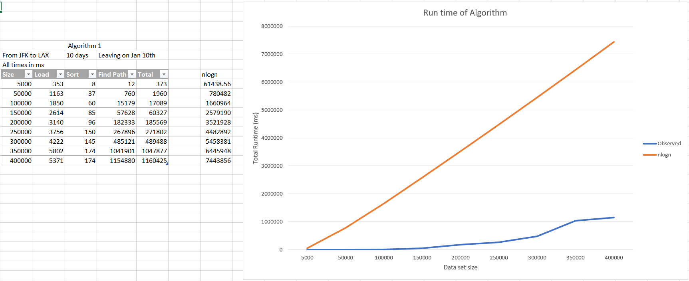

# COSC320Project

## Dataset.
Include the details of the dataset.
https://data.world/hoytick/2017-jan-ontimeflightdata-usa

After sanitizing embedded commas: https://drive.google.com/file/d/12hLtOJa23qFEsBJklDeyYuNkUCQW4MHN/view?usp=sharing

This dataset contains flight information for 450000 domestic US flights from 2017. The relevant data fields are year, month, dayofmonth, carrier, flightnum, originairportid, origincityname, destinationairportid, destinationairportid, deptime, arrtime. There is no ticketprice data feild in this dataset, but using the distance feild, we created reasonable estimates for the price. From the site (Rometorio)[https://www.rome2rio.com/blog/2013/01/02/170779446/], it costs about $50 + 11 cents per mile for a ticket. So, we can get a ticket cost = 50 + (distance)(0.11)(normal distribution).  Every flight will cost a $50 plus a normally distributed number with mean 1, std 0.02 around 11 cents per mile. If the normal distribution returns a negative number replace it with 1.

## Implementation. 
We began by defining a Flight class for each row in our dataset. It contains important information about the edges of the graph we will be creating, such as originairportid, destinationairportid, departure and arrival times, and flightTime/ticketCost. Then, we implemented a node class to represent the airports on our graph. There can be multiple nodes all corresonding to the same airport, but with different arrival times and thus a different SortedSet of viable outgoing Flights. Each node contains a heuristic that holds the total time it has taken to reach this node, starting from midnight on the day selected to leave. This heuristic is used in the compareTo method that will sort the nodes reachable from any given airport with the lowest heuristic first. At the begining of the main method, there is a buildMap function called that creates the graph. This step takes the origin airport and constructs nodes from each of its outgoing flights. Then, each of these nodes constructs new nodes from each of their outgoing flights. This is by far the most computationally heavy step and it runs in O(nm) time where n is the number of edges and m is the number of airports in the graph. Then, in our algorithms outlined in milestone 1, we can walk through the graph taking node with the samllest heuristic (sorted when the tree was created) to look at first and the first time we find the destination it is going to have been reached by the cheapest path. While walking through the tree could take up to O(nm) time, the preprocessing done when we created the graph means there will be very small constants and this ins generally not a time consuming step.

## Results. 
As mentioned in our Unexpected Cases, we did not have time to create appropriate samples, so we did not have a range of inputs to test. However, our algorithm did run on the whole dataset in ~2000 milliseconds, which is fairly efficient considering our dataset has 450 thousand entries. We did notice that searching on price took significantly longer. We suspect this is because price is a weaker heuristic value compared to time. We believe that this is on track with the O(nm) curve that we expect our algorithm to approach. Most of the work is done in the graph creation step, with lots of sorted lists all taking O(log n) time to create and sort.

### New as of April 8th
We have had time to test the algorithm using sample datasets of various sizes, and these are the results.

As the graph shows, the algorithm runs in O(nlogn) time as we showed in milestone 1. While there was a significant jump in the time from 300 thousand to 350000 flights, the sample with 400 thousand flights took barely longer, and we are confident that this will stay under the provided nlogn time. 

## Unexpected Cases/Difficulties. 
Our dataset had no cost field. This was resolved by creating a cost function to simulate the cost of tickets. However, due to the inherient properties of random variables, right now any ticket price, however unlikely, could be possible. This was resolved by putting a lower bound on the normal distributions, it cannot be negative. 

We had a significant number of rollover error when the flights took off late on one day and landed early on the next. Since our dataset only contains the takeoff date, the algorithm was reading these flights as having ~ -23 hour durations. The presence of negative edges like this will disrupt our algorithm as it allows for negative cycles to exist and the same flight to be taken multiple times. 

Finally, we had lots of trouble making samples of the dataset to use a tests on our algorithm. The fields were often changed in subtle ways that caused errors in our program and we did not have enough time to solve them all. 

## Task Separation and Responsibilities. 
* Josh - Implement Main, Node and debugging/refactoring
* Ryan - Implement Flight and debugging
* Mike - Implemented FlightList and debugging
* Liza - Data read-in
